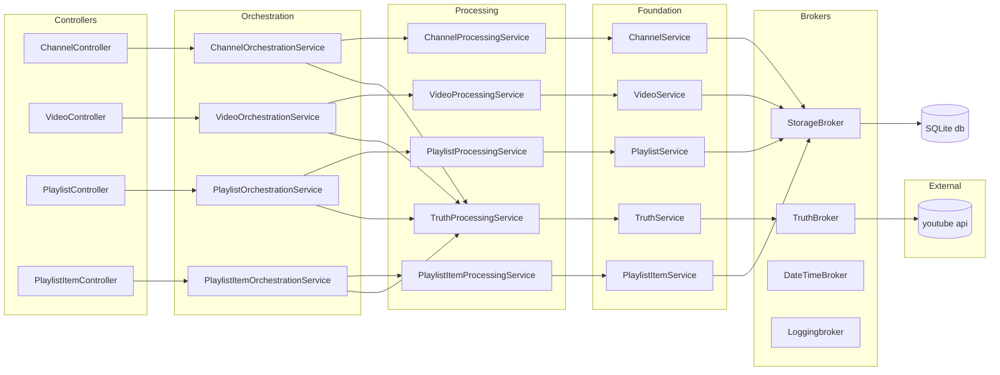

### Servisų, brokerių ryšiai

```mermaid
graph LR;
    ChannelController --> ChannelOrchestrationService --> ChannelProcessingService --> ChannelService;
    VideoController --> VideoOrchestrationService --> VideoProcessingService --> VideoService;
    PlaylistController --> PlaylistOrchestrationService --> PlaylistProcessingService --> PlaylistService;
    PlaylistItemController --> PlaylistItemOrchestrationService --> PlaylistItemProcessingService --> PlaylistItemService;

    VideoService & ChannelService & PlaylistService & PlaylistItemService --> StorageBroker --> db[(SQLite db)];
    VideoOrchestrationService & ChannelOrchestrationService & PlaylistOrchestrationService & PlaylistItemOrchestrationService --> TruthProcessingService --> TruthService --> TruthBroker --> yt;

    subgraph External
        yt[(youtube api)];
    end
    subgraph Controllers
        ChannelController;
        VideoController;
        PlaylistController;
        PlaylistItemController;
    end
    subgraph Orchestration
        ChannelOrchestrationService;
        VideoOrchestrationService;
        PlaylistOrchestrationService;
        PlaylistItemOrchestrationService;
    end
    subgraph Processing
        ChannelProcessingService;
        VideoProcessingService;
        PlaylistProcessingService;
        PlaylistItemProcessingService;
        TruthProcessingService;
    end
    subgraph Foundation
        ChannelService;
        VideoService;
        PlaylistService;
        PlaylistItemService;
        TruthService;
    end
    subgraph Brokers
        StorageBroker;
        TruthBroker;
        DateTimeBroker;
        Loggingbroker;
    end
```
